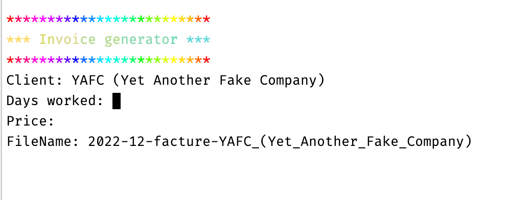

# Invoice generator

## What is it ?
This is a tool for myself, helping me to generate invoices quickly and with no mistakes (forgetting to change the invoice number, the current month...).

## What does it do ?
It generates a PDF invoice, based on a template, some configuration data (company data) and the data typed in  

## init
- copy `src/assets/data/clients.template.json` as `src/assets/data/clients.json`.
- do the same for `src/assets/data/company.template.json` => `src/assets/data/company.template.json`
- run `yarn` to install dependencies
- run `yarn build`

## run
- `yarn start`
- enjoy

## Can I customize the invoice template ?
Of course ; it's in `src/assets/invoice-template.html`. 

It uses [Mustache.js](https://github.com/janl/mustache.js/) under the hood, so variables are into two pairs of curly braces. 

If you want to add/remove fields to/from the invoice template, think about add/remove invoice data in `src/invoice/prepare-invoice-data.ts`.

There is also a few "hard coded" data, such as the invoice line, which you can modify in `src/invoice/prepare-invoice-data.ts`.
